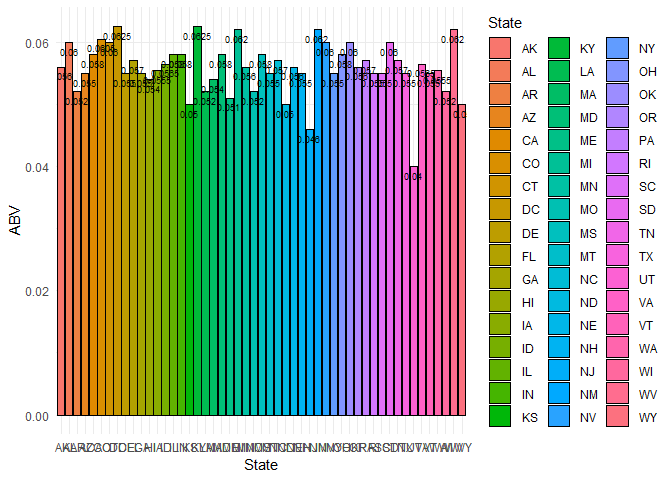
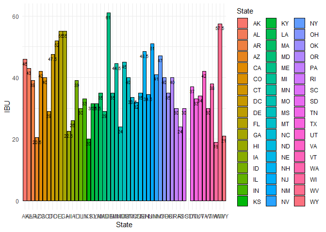
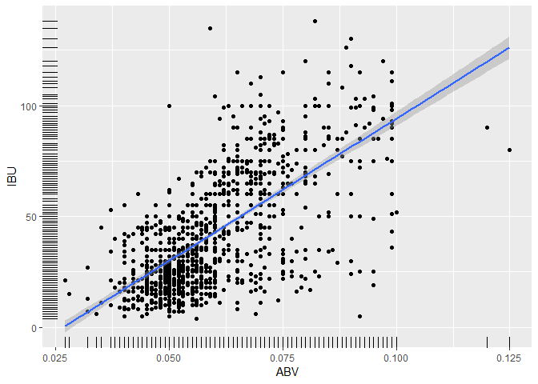

Beer Case Study
================

``` r
require(plyr)
```

    ## Loading required package: plyr

``` r
require(dplyr)
```

    ## Loading required package: dplyr

    ## 
    ## Attaching package: 'dplyr'

    ## The following objects are masked from 'package:plyr':
    ## 
    ##     arrange, count, desc, failwith, id, mutate, rename, summarise,
    ##     summarize

    ## The following objects are masked from 'package:stats':
    ## 
    ##     filter, lag

    ## The following objects are masked from 'package:base':
    ## 
    ##     intersect, setdiff, setequal, union

``` r
require(tidyr)
```

    ## Loading required package: tidyr

``` r
require(ggplot2)
```

    ## Loading required package: ggplot2

``` r
beers <- read.csv("Dataset/Beers.csv",stringsAsFactor=FALSE)
breweries <- read.csv("Dataset/Breweries.csv",stringsAsFactor=FALSE)

# Assign column names
colnames(beers) <- c("Beer","Beer_ID","ABV","IBU","Brewery_id","Style","Ounces")
colnames(breweries) <- c("Brew_ID","Breweries","City","State")
both <- beers %>% inner_join(breweries, by = c("Brewery_id" = "Brew_ID"))
```

1. How many breweries are present in each state?
------------------------------------------------

``` r
brews_state <- breweries %>% group_by(State) %>% count()
brews_state
```

    ## # A tibble: 51 x 2
    ## # Groups:   State [51]
    ##    State     n
    ##    <chr> <int>
    ##  1 " AK"     7
    ##  2 " AL"     3
    ##  3 " AR"     2
    ##  4 " AZ"    11
    ##  5 " CA"    39
    ##  6 " CO"    47
    ##  7 " CT"     8
    ##  8 " DC"     1
    ##  9 " DE"     2
    ## 10 " FL"    15
    ## # ... with 41 more rows

``` r
p.state <- ggplot(data=brews_state, aes(x=State, y=n, fill=State))
p.state <- p.state + geom_bar(stat="identity", color="black", position=position_dodge())+theme_minimal()
p.state <- p.state + geom_text(aes(label=n), vjust=1.6, position = position_dodge(0.9), size=2.5)
p.state
```


``` r
# Output brews_state data to csv for Excel charts for presentation
state.data <- "Beer_Case_Study_files/state.csv"
write.csv(brews_state, file = state.data)
```

2. Merge beer data with the breweries data. Print the first 6 observations and the last six observations to check the merged file
---------------------------------------------------------------------------------------------------------------------------------

``` r
both <- beers %>% inner_join(breweries, by = c("Brewery_id" = "Brew_ID"))

both_full <- beers %>% full_join(breweries, by = c("Brewery_id" = "Brew_ID"))

head(both_full,6)
```

    ##                  Beer Beer_ID   ABV IBU Brewery_id
    ## 1            Pub Beer    1436 0.050  NA        409
    ## 2         Devil's Cup    2265 0.066  NA        178
    ## 3 Rise of the Phoenix    2264 0.071  NA        178
    ## 4            Sinister    2263 0.090  NA        178
    ## 5       Sex and Candy    2262 0.075  NA        178
    ## 6        Black Exodus    2261 0.077  NA        178
    ##                            Style Ounces                 Breweries City
    ## 1            American Pale Lager     12 10 Barrel Brewing Company Bend
    ## 2        American Pale Ale (APA)     12       18th Street Brewery Gary
    ## 3                   American IPA     12       18th Street Brewery Gary
    ## 4 American Double / Imperial IPA     12       18th Street Brewery Gary
    ## 5                   American IPA     12       18th Street Brewery Gary
    ## 6                  Oatmeal Stout     12       18th Street Brewery Gary
    ##   State
    ## 1    OR
    ## 2    IN
    ## 3    IN
    ## 4    IN
    ## 5    IN
    ## 6    IN

``` r
tail(both_full,6)
```

    ##                             Beer Beer_ID   ABV IBU Brewery_id
    ## 2405 Rocky Mountain Oyster Stout    1035 0.075  NA        425
    ## 2406                   Belgorado     928 0.067  45        425
    ## 2407               Rail Yard Ale     807 0.052  NA        425
    ## 2408             B3K Black Lager     620 0.055  NA        425
    ## 2409         Silverback Pale Ale     145 0.055  40        425
    ## 2410        Rail Yard Ale (2009)      84 0.052  NA        425
    ##                         Style Ounces               Breweries   City State
    ## 2405           American Stout     12 Wynkoop Brewing Company Denver    CO
    ## 2406              Belgian IPA     12 Wynkoop Brewing Company Denver    CO
    ## 2407 American Amber / Red Ale     12 Wynkoop Brewing Company Denver    CO
    ## 2408              Schwarzbier     12 Wynkoop Brewing Company Denver    CO
    ## 2409  American Pale Ale (APA)     12 Wynkoop Brewing Company Denver    CO
    ## 2410 American Amber / Red Ale     12 Wynkoop Brewing Company Denver    CO

3. Report the number of NA's in each column.
--------------------------------------------

``` r
sapply(both, function(x) {sum(is.na(x))})
```

    ##       Beer    Beer_ID        ABV        IBU Brewery_id      Style 
    ##          0          0         62       1005          0          0 
    ##     Ounces  Breweries       City      State 
    ##          0          0          0          0

4. Compute the median alcohol content and international bitterness unit for each state. Plot a bar chart to compare.
--------------------------------------------------------------------------------------------------------------------

``` r
ABV_IBU <- both %>% group_by(State) %>% summarise(ABV = median(ABV, na.rm = TRUE), IBU = median(IBU, na.rm = TRUE))

# Output ABV_IBU data by state to csv for Excel charts for presentation
ABV.IBU.data <- "Beer_Case_Study_files/ABV_IBU_by_State.csv"
write.csv(ABV_IBU, file = ABV.IBU.data)

p.ABV <- ggplot(data=ABV_IBU, aes(x=State, y=ABV, fill=State))
p.ABV <- p.ABV + geom_bar(stat="identity", color="black", position=position_dodge())+theme_minimal()
p.ABV <- p.ABV + geom_text(aes(label=ABV), vjust=1.6, position = position_dodge(0.9), size=2.5)
p.ABV
```



``` r
p.IBU <- ggplot(data=ABV_IBU, aes(x=State, y=IBU, fill=State))
p.IBU <- p.IBU + geom_bar(stat="identity", color="black", position=position_dodge())+theme_minimal()
p.IBU <- p.IBU + geom_text(aes(label=IBU), vjust=1.6, position = position_dodge(0.9), size=2.5)
p.IBU
```

    ## Warning: Removed 1 rows containing missing values (geom_bar).

    ## Warning: Removed 1 rows containing missing values (geom_text).



5. Which state has the maximum alcoholic (ABV) beer? Which state has the most bitter (IBU) beer?
------------------------------------------------------------------------------------------------

``` r
maxABV_IBU <- both %>% group_by(State) %>% summarise(ABV = max(ABV, na.rm = TRUE), IBU = max(IBU, na.rm = TRUE))
maxABV <- maxABV_IBU %>% filter(ABV == max(ABV))
maxIBU <- maxABV_IBU %>% filter(IBU == max(IBU))

maxABV[, c(1,2)]
```

    ## # A tibble: 1 x 2
    ##   State   ABV
    ##   <chr> <dbl>
    ## 1 " CO" 0.128

``` r
maxIBU[, c(1,3)]
```

    ## # A tibble: 1 x 2
    ##   State   IBU
    ##   <chr> <dbl>
    ## 1 " OR"   138

6. Summary statistics for the ABV variable
------------------------------------------

``` r
summary(both$ABV)
```

    ##    Min. 1st Qu.  Median    Mean 3rd Qu.    Max.    NA's 
    ## 0.00100 0.05000 0.05600 0.05977 0.06700 0.12800      62

7. Is there an apparent relationship between the bitterness of the beer and its alcoholic content? Draw a scatter plot.
-----------------------------------------------------------------------------------------------------------------------

``` r
lmABV_IBU <- na.omit(both)
p.ABV_IBU <- ggplot(lmABV_IBU, aes(x = ABV, y = IBU), na.rm = TRUE) + geom_point(na.rm = TRUE) + geom_rug() 
p.ABU_IBU <- p.ABV_IBU + geom_smooth(method=lm)
p.ABU_IBU
```



``` r
# Output ABV_IBU full data to csv for Excel charts for presentation
outputlink<- lmABV_IBU[,3:4]
linkData.data <- "Beer_Case_Study_files/ABV_IBU_link.csv"
write.csv(outputlink, file = linkData.data)
```
