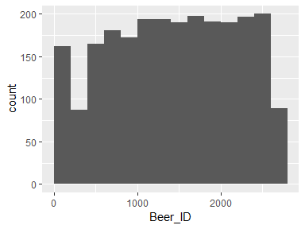
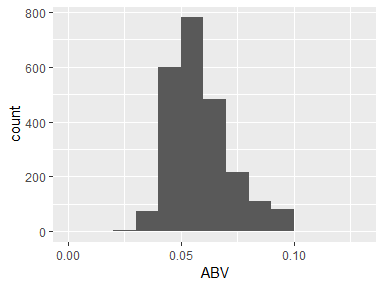
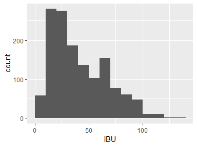
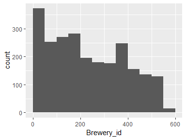
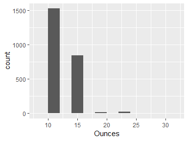

Data report overview
====================

The dataset examined has the following dimensions:

<table style="width:46%;">
<colgroup>
<col width="34%" />
<col width="11%" />
</colgroup>
<thead>
<tr class="header">
<th align="left">Feature</th>
<th align="right">Result</th>
</tr>
</thead>
<tbody>
<tr class="odd">
<td align="left">Number of observations</td>
<td align="right">2410</td>
</tr>
<tr class="even">
<td align="left">Number of variables</td>
<td align="right">7</td>
</tr>
</tbody>
</table>

Codebook summary table
======================

<table>
<colgroup>
<col width="11%" />
<col width="27%" />
<col width="13%" />
<col width="15%" />
<col width="13%" />
<col width="18%" />
</colgroup>
<thead>
<tr class="header">
<th align="left">Label</th>
<th align="left">Variable</th>
<th align="left">Class</th>
<th align="right"># unique values</th>
<th align="center">Missing</th>
<th align="left">Description</th>
</tr>
</thead>
<tbody>
<tr class="odd">
<td align="left"></td>
<td align="left"><strong><a href="#name">Name</a></strong></td>
<td align="left">factor</td>
<td align="right">2305</td>
<td align="center">0.00 %</td>
<td align="left">Name of the beer</td>
</tr>
<tr class="even">
<td align="left"></td>
<td align="left"><strong><a href="#beer_id">Beer_ID</a></strong></td>
<td align="left">integer</td>
<td align="right">2410</td>
<td align="center">0.00 %</td>
<td align="left">Unique identifier of the beer</td>
</tr>
<tr class="odd">
<td align="left"></td>
<td align="left"><strong><a href="#abv">ABV</a></strong></td>
<td align="left">numeric</td>
<td align="right">75</td>
<td align="center">2.57 %</td>
<td align="left">Alcohol by volume of the beer.</td>
</tr>
<tr class="even">
<td align="left"></td>
<td align="left"><strong><a href="#ibu">IBU</a></strong></td>
<td align="left">integer</td>
<td align="right">108</td>
<td align="center">41.70 %</td>
<td align="left">International Bitterness Units of the beer.</td>
</tr>
<tr class="odd">
<td align="left"></td>
<td align="left"><strong><a href="#brewery_id">Brewery_id</a></strong></td>
<td align="left">integer</td>
<td align="right">558</td>
<td align="center">0.00 %</td>
<td align="left">Brewery id associated with the beer.</td>
</tr>
<tr class="even">
<td align="left"></td>
<td align="left"><strong><a href="#style">Style</a></strong></td>
<td align="left">factor</td>
<td align="right">100</td>
<td align="center">0.00 %</td>
<td align="left">Style of the beer</td>
</tr>
<tr class="odd">
<td align="left"></td>
<td align="left"><strong><a href="#ounces">Ounces</a></strong></td>
<td align="left">numeric</td>
<td align="right">7</td>
<td align="center">0.00 %</td>
<td align="left">Ounces of beer</td>
</tr>
</tbody>
</table>

Variable list
=============

Name
----

<table style="width:72%;">
<colgroup>
<col width="36%" />
<col width="36%" />
</colgroup>
<thead>
<tr class="header">
<th align="left">Feature</th>
<th align="right">Result</th>
</tr>
</thead>
<tbody>
<tr class="odd">
<td align="left">Variable type</td>
<td align="right">factor</td>
</tr>
<tr class="even">
<td align="left">Number of missing obs.</td>
<td align="right">0 (0 %)</td>
</tr>
<tr class="odd">
<td align="left">Number of unique values</td>
<td align="right">2305</td>
</tr>
<tr class="even">
<td align="left">Mode</td>
<td align="right">&quot;Nonstop Hef Hop&quot;</td>
</tr>
<tr class="odd">
<td align="left">Reference category</td>
<td align="right">#001 Golden Amber Lager</td>
</tr>
</tbody>
</table>

------------------------------------------------------------------------

Beer\_ID
--------

<table style="width:60%;">
<colgroup>
<col width="36%" />
<col width="23%" />
</colgroup>
<thead>
<tr class="header">
<th align="left">Feature</th>
<th align="right">Result</th>
</tr>
</thead>
<tbody>
<tr class="odd">
<td align="left">Variable type</td>
<td align="right">integer</td>
</tr>
<tr class="even">
<td align="left">Number of missing obs.</td>
<td align="right">0 (0 %)</td>
</tr>
<tr class="odd">
<td align="left">Number of unique values</td>
<td align="right">2410</td>
</tr>
<tr class="even">
<td align="left">Median</td>
<td align="right">1453.5</td>
</tr>
<tr class="odd">
<td align="left">1st and 3rd quartiles</td>
<td align="right">808.25; 2075.75</td>
</tr>
<tr class="even">
<td align="left">Min. and max.</td>
<td align="right">1; 2692</td>
</tr>
</tbody>
</table>

------------------------------------------------------------------------

ABV
---

<table style="width:54%;">
<colgroup>
<col width="36%" />
<col width="18%" />
</colgroup>
<thead>
<tr class="header">
<th align="left">Feature</th>
<th align="right">Result</th>
</tr>
</thead>
<tbody>
<tr class="odd">
<td align="left">Variable type</td>
<td align="right">numeric</td>
</tr>
<tr class="even">
<td align="left">Number of missing obs.</td>
<td align="right">62 (2.57 %)</td>
</tr>
<tr class="odd">
<td align="left">Number of unique values</td>
<td align="right">74</td>
</tr>
<tr class="even">
<td align="left">Median</td>
<td align="right">0.06</td>
</tr>
<tr class="odd">
<td align="left">1st and 3rd quartiles</td>
<td align="right">0.05; 0.07</td>
</tr>
<tr class="even">
<td align="left">Min. and max.</td>
<td align="right">0; 0.13</td>
</tr>
</tbody>
</table>

------------------------------------------------------------------------

IBU
---

<table style="width:57%;">
<colgroup>
<col width="36%" />
<col width="20%" />
</colgroup>
<thead>
<tr class="header">
<th align="left">Feature</th>
<th align="right">Result</th>
</tr>
</thead>
<tbody>
<tr class="odd">
<td align="left">Variable type</td>
<td align="right">integer</td>
</tr>
<tr class="even">
<td align="left">Number of missing obs.</td>
<td align="right">1005 (41.7 %)</td>
</tr>
<tr class="odd">
<td align="left">Number of unique values</td>
<td align="right">107</td>
</tr>
<tr class="even">
<td align="left">Median</td>
<td align="right">35</td>
</tr>
<tr class="odd">
<td align="left">1st and 3rd quartiles</td>
<td align="right">21; 64</td>
</tr>
<tr class="even">
<td align="left">Min. and max.</td>
<td align="right">4; 138</td>
</tr>
</tbody>
</table>

------------------------------------------------------------------------

Brewery\_id
-----------

<table style="width:49%;">
<colgroup>
<col width="36%" />
<col width="12%" />
</colgroup>
<thead>
<tr class="header">
<th align="left">Feature</th>
<th align="right">Result</th>
</tr>
</thead>
<tbody>
<tr class="odd">
<td align="left">Variable type</td>
<td align="right">integer</td>
</tr>
<tr class="even">
<td align="left">Number of missing obs.</td>
<td align="right">0 (0 %)</td>
</tr>
<tr class="odd">
<td align="left">Number of unique values</td>
<td align="right">558</td>
</tr>
<tr class="even">
<td align="left">Median</td>
<td align="right">206</td>
</tr>
<tr class="odd">
<td align="left">1st and 3rd quartiles</td>
<td align="right">94; 367</td>
</tr>
<tr class="even">
<td align="left">Min. and max.</td>
<td align="right">1; 558</td>
</tr>
</tbody>
</table>

------------------------------------------------------------------------

Style
-----

<table style="width:58%;">
<colgroup>
<col width="36%" />
<col width="22%" />
</colgroup>
<thead>
<tr class="header">
<th align="left">Feature</th>
<th align="right">Result</th>
</tr>
</thead>
<tbody>
<tr class="odd">
<td align="left">Variable type</td>
<td align="right">factor</td>
</tr>
<tr class="even">
<td align="left">Number of missing obs.</td>
<td align="right">0 (0 %)</td>
</tr>
<tr class="odd">
<td align="left">Number of unique values</td>
<td align="right">100</td>
</tr>
<tr class="even">
<td align="left">Mode</td>
<td align="right">&quot;American IPA&quot;</td>
</tr>
<tr class="odd">
<td align="left">Reference category</td>
<td align="right"></td>
</tr>
</tbody>
</table>

------------------------------------------------------------------------

Ounces
------

<table style="width:49%;">
<colgroup>
<col width="36%" />
<col width="12%" />
</colgroup>
<thead>
<tr class="header">
<th align="left">Feature</th>
<th align="right">Result</th>
</tr>
</thead>
<tbody>
<tr class="odd">
<td align="left">Variable type</td>
<td align="right">numeric</td>
</tr>
<tr class="even">
<td align="left">Number of missing obs.</td>
<td align="right">0 (0 %)</td>
</tr>
<tr class="odd">
<td align="left">Number of unique values</td>
<td align="right">7</td>
</tr>
<tr class="even">
<td align="left">Median</td>
<td align="right">12</td>
</tr>
<tr class="odd">
<td align="left">1st and 3rd quartiles</td>
<td align="right">12; 16</td>
</tr>
<tr class="even">
<td align="left">Min. and max.</td>
<td align="right">8.4; 32</td>
</tr>
</tbody>
</table>

------------------------------------------------------------------------
