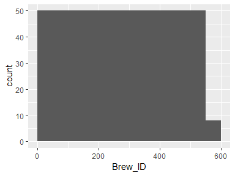
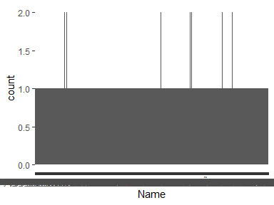
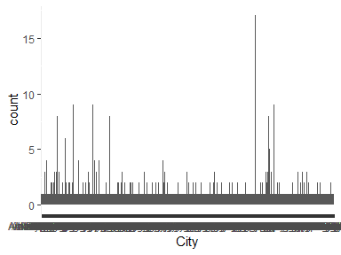
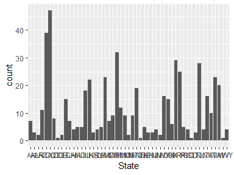

Data report overview
====================

The dataset examined has the following dimensions:

<table style="width:46%;">
<colgroup>
<col width="34%" />
<col width="11%" />
</colgroup>
<thead>
<tr class="header">
<th align="left">Feature</th>
<th align="right">Result</th>
</tr>
</thead>
<tbody>
<tr class="odd">
<td align="left">Number of observations</td>
<td align="right">558</td>
</tr>
<tr class="even">
<td align="left">Number of variables</td>
<td align="right">4</td>
</tr>
</tbody>
</table>

Codebook summary table
======================

<table style="width:96%;">
<colgroup>
<col width="11%" />
<col width="23%" />
<col width="13%" />
<col width="15%" />
<col width="13%" />
<col width="18%" />
</colgroup>
<thead>
<tr class="header">
<th align="left">Label</th>
<th align="left">Variable</th>
<th align="left">Class</th>
<th align="right"># unique values</th>
<th align="center">Missing</th>
<th align="left">Description</th>
</tr>
</thead>
<tbody>
<tr class="odd">
<td align="left"></td>
<td align="left"><strong><a href="#brew_id">Brew_ID</a></strong></td>
<td align="left">integer</td>
<td align="right">558</td>
<td align="center">0.00 %</td>
<td align="left">Unique identifier of the brewery</td>
</tr>
<tr class="even">
<td align="left"></td>
<td align="left"><strong><a href="#name">Name</a></strong></td>
<td align="left">factor</td>
<td align="right">551</td>
<td align="center">0.00 %</td>
<td align="left">Name of the brewery</td>
</tr>
<tr class="odd">
<td align="left"></td>
<td align="left"><strong><a href="#city">City</a></strong></td>
<td align="left">factor</td>
<td align="right">384</td>
<td align="center">0.00 %</td>
<td align="left">City where the brewery is located</td>
</tr>
<tr class="even">
<td align="left"></td>
<td align="left"><strong><a href="#state">State</a></strong></td>
<td align="left">factor</td>
<td align="right">51</td>
<td align="center">0.00 %</td>
<td align="left">U.S. State where the brewery is located</td>
</tr>
</tbody>
</table>

Variable list
=============

Brew\_ID
--------

<table style="width:58%;">
<colgroup>
<col width="36%" />
<col width="22%" />
</colgroup>
<thead>
<tr class="header">
<th align="left">Feature</th>
<th align="right">Result</th>
</tr>
</thead>
<tbody>
<tr class="odd">
<td align="left">Variable type</td>
<td align="right">integer</td>
</tr>
<tr class="even">
<td align="left">Number of missing obs.</td>
<td align="right">0 (0 %)</td>
</tr>
<tr class="odd">
<td align="left">Number of unique values</td>
<td align="right">558</td>
</tr>
<tr class="even">
<td align="left">Median</td>
<td align="right">279.5</td>
</tr>
<tr class="odd">
<td align="left">1st and 3rd quartiles</td>
<td align="right">140.25; 418.75</td>
</tr>
<tr class="even">
<td align="left">Min. and max.</td>
<td align="right">1; 558</td>
</tr>
</tbody>
</table>

------------------------------------------------------------------------

Name
----

<table style="width:74%;">
<colgroup>
<col width="36%" />
<col width="37%" />
</colgroup>
<thead>
<tr class="header">
<th align="left">Feature</th>
<th align="right">Result</th>
</tr>
</thead>
<tbody>
<tr class="odd">
<td align="left">Variable type</td>
<td align="right">factor</td>
</tr>
<tr class="even">
<td align="left">Number of missing obs.</td>
<td align="right">0 (0 %)</td>
</tr>
<tr class="odd">
<td align="left">Number of unique values</td>
<td align="right">551</td>
</tr>
<tr class="even">
<td align="left">Mode</td>
<td align="right">&quot;Blackrocks Brewery&quot;</td>
</tr>
<tr class="odd">
<td align="left">Reference category</td>
<td align="right">10 Barrel Brewing Company</td>
</tr>
</tbody>
</table>

------------------------------------------------------------------------

City
----

<table style="width:53%;">
<colgroup>
<col width="36%" />
<col width="16%" />
</colgroup>
<thead>
<tr class="header">
<th align="left">Feature</th>
<th align="right">Result</th>
</tr>
</thead>
<tbody>
<tr class="odd">
<td align="left">Variable type</td>
<td align="right">factor</td>
</tr>
<tr class="even">
<td align="left">Number of missing obs.</td>
<td align="right">0 (0 %)</td>
</tr>
<tr class="odd">
<td align="left">Number of unique values</td>
<td align="right">384</td>
</tr>
<tr class="even">
<td align="left">Mode</td>
<td align="right">&quot;Portland&quot;</td>
</tr>
<tr class="odd">
<td align="left">Reference category</td>
<td align="right">Abingdon</td>
</tr>
</tbody>
</table>

------------------------------------------------------------------------

State
-----

<table style="width:49%;">
<colgroup>
<col width="36%" />
<col width="12%" />
</colgroup>
<thead>
<tr class="header">
<th align="left">Feature</th>
<th align="right">Result</th>
</tr>
</thead>
<tbody>
<tr class="odd">
<td align="left">Variable type</td>
<td align="right">factor</td>
</tr>
<tr class="even">
<td align="left">Number of missing obs.</td>
<td align="right">0 (0 %)</td>
</tr>
<tr class="odd">
<td align="left">Number of unique values</td>
<td align="right">51</td>
</tr>
<tr class="even">
<td align="left">Mode</td>
<td align="right">&quot; CO&quot;</td>
</tr>
<tr class="odd">
<td align="left">Reference category</td>
<td align="right">AK</td>
</tr>
</tbody>
</table>

-   Observed factor levels: " AK", " AL", " AR", " AZ", " CA", " CO", " CT", " DC", " DE", " FL", " GA", " HI", " IA", " ID", " IL", " IN", " KS", " KY", " LA", " MA", " MD", " ME", " MI", " MN", " MO", " MS", " MT", " NC", " ND", " NE", " NH", " NJ", " NM", " NV", " NY", " OH", " OK", " OR", " PA", " RI", " SC", " SD", " TN", " TX", " UT", " VA", " VT", " WA", " WI", " WV", " WY".

------------------------------------------------------------------------
